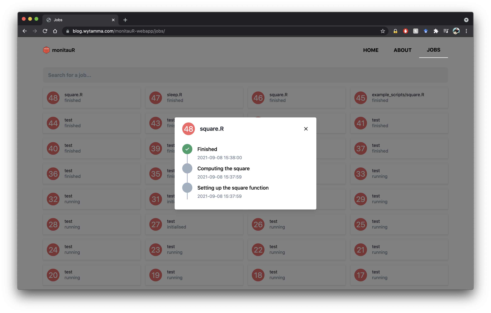

# monitauR 

A package to easily and remotely monitor the progress of your R scripts.

```R
devtools::install_github("wytamma/monitauR")
```

## Example 

Consider the script `example_scripts/square.R`

```R
#< Setting up the square function
square <- function(x) {
  x*x
}
#< Computing the square
square(5)
```

The `#<` comments are special comments that tell monitauR to log these steps. The comment syntaxt can be changed using the `comment_syntax` option in `monitauR::monitor` e.g. `monitauR::monitor('example_scripts/square.R', comment_syntax="#")` to log normal comments. 

```bash
Rscript -e "monitauR::monitor('example_scripts/square.R')"
```
```
Job 1: --- Initialised ---
Job 1: Setting up the square function (1/2)
Job 1: Computing the square (2/2)
Job 1: --- Finished ---
```

Alternatively you can include a call to `monitauR::monitor()` at the top of the script and run the script normally with `$ Rscript example_scripts/square.R` or `> source("example_scripts/square.R")`

```R
monitauR::monitor()
#< Setting up the square function
square <- function(x) {
  x*x
}
#< Computing the square
square(5)
```
```
Job 2: --- Initialised ---
Job 2: Setting up the square function (1/2)
Job 2: Computing the square (2/2)
Job 2: --- Finished ---
```

The scripts are logged to an api `https://monitaur-api.herokuapp.com/jobs` and can be view using the web app at `https://blog.wytamma.com/monitauR-webapp/jobs/`.

[](https://blog.wytamma.com/monitauR-webapp/jobs/)

```bash
curl 'https://monitaur-api.herokuapp.com/jobs' | json_pp
```
```json
[
   {
      "created" : "2020-09-07 14:49:35",
      "id" : 1,
      "name" : "example_scripts/square.R",
      "status" : "finished",
      "updated" : "2020-09-07 14:49:35"
   }
]
```
```bash
curl 'https://monitaur-api.herokuapp.com/steps' | json_pp

```
```json
[
   {
      "created" : "2020-09-07 14:49:35",
      "id" : 1,
      "job_id" : 1,
      "msg" : "Setting up the square function",
      "updated" : "2020-09-07 14:49:35"
   },
   {
      "created" : "2020-09-07 14:49:35",
      "id" : 2,
      "job_id" : 1,
      "msg" : "Computing the square",
      "updated" : "2020-09-07 14:49:35"
   }
]
```

## Explanation 

There is a [plumber api](https://www.rplumber.io/) running on [https://monitaur-api.herokuapp.com/](https://monitaur-api.herokuapp.com/) that receives and logs requests from `monitauR::monitor`. The script infile (`example_scripts/square.R`) has a special comment syntax (`#<`) that tells `monitauR::monitor` when to send a logging request. 

While evaluating the script when the special comment (`#<`) is reached a request is sent to the server telling it to log the step.

### lifecycle of a monitauR script

1. The script is parsed and the expressions are extracted
2. Job ID is generated (status set to initialised)
3. A future is created (using the Job ID) for each special comment step
4. Job status is set to running
5. Script is evaluated and futures are run in sequential order 
6. Any errors are caught and sent to the server (status set to error)
7. When the script completes the Job status is set to finished


## MonitauR-api

Details for the default plumber api can be found [here](https://github.com/Wytamma/monitauR-api). However, the default api is shared and anyone can add to or edit the data on there, and the data might be wiped at any point. If you want your own private server you could deploy your own API and replace the `API_URL` pram in `monitauR::monitor`.

## MonitauR-webapp

Jobs can be monitored via `/jobs` section of webapp found at [https://wytamma.github.io/monitauR-webapp](https://wytamma.github.io/monitauR-webapp). Details for the webapp can be found [here](https://github.com/Wytamma/monitauR-webapp). 

## Docker dev env

```bash
docker run --rm -p 8787:8787  -v $(pwd):/home/rstudio -e ROOT=TRUE -e PASSWORD=yourpasswordhere rocker/rstudio
```

